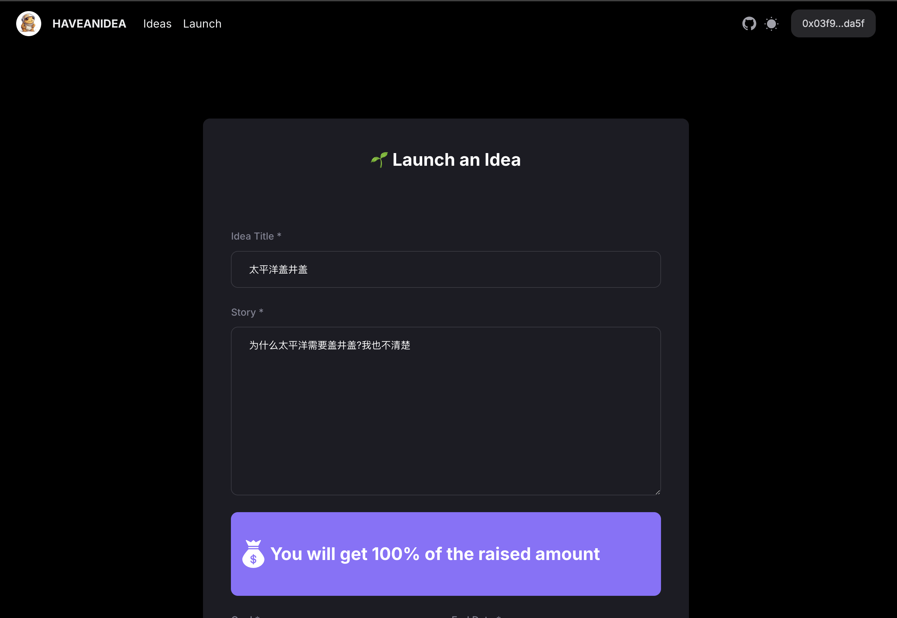
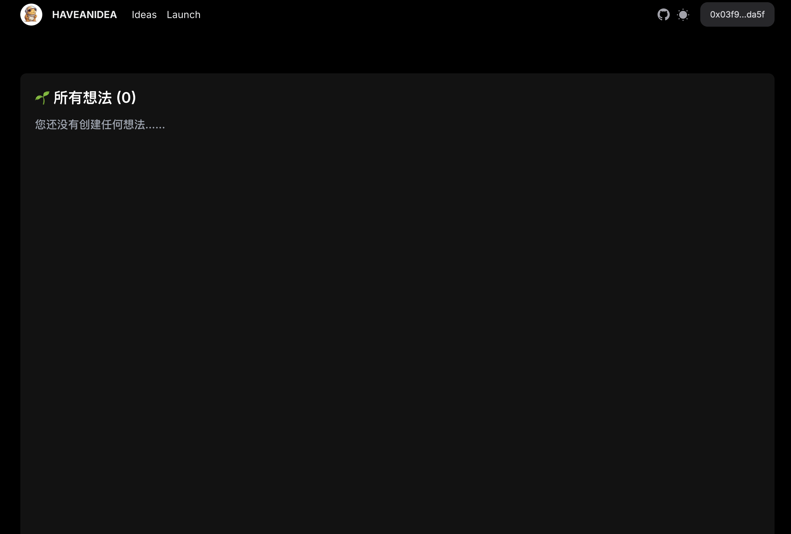

# HAVEANIDEA.ME

**HAVEANIDEA.ME** 是一个旨在帮助草根实现梦想的众筹平台。该项目基于以太坊 (ETH) 实现，鼓励用户分享和支持创意。

## 技术栈
- **TypeScript**: 为项目提供强类型支持，提高代码的可维护性和可读性。
- **Next.js**: 用于构建高性能的前端应用，提供良好的用户体验，支持服务器渲染和静态生成。
- **NextUI**: 提供现代化的 UI 组件，帮助快速开发美观的界面，提升用户交互体验。
- **Solidity**: 用于编写智能合约，实现众筹逻辑和资金管理，确保安全和透明。
- **Truffle**: 用于开发、测试和部署智能合约，简化以太坊开发流程，支持快速迭代。
- **Ganache**: 一个以太坊本地区块链模拟器，用于快速测试和开发智能合约，提供用户友好的界面。
- **MetaMask**: 一个流行的以太坊钱包，支持用户管理资产并与去中心化应用（dApps）交互。
- **Sepolia**: 以太坊的测试网络，允许开发者在真实环境中测试智能合约，而无需使用真实的 ETH。

## 功能特性
- **发起众筹**: 用户可以创建众筹项目，设定目标金额和截止日期，分享他们的创意和愿景。
- **参与众筹**: 支持者可以浏览各类项目，选择自己感兴趣的项目进行资助，帮助实现他人的梦想。
- **众筹退款**: 提供保障机制，确保在项目未达到目标或未能按承诺交付时，支持者能够申请退款。
- **申请使用资金**: 发起人可以申请使用筹集到的资金，需提供详细的资金使用计划以供审核。
- **同意资金使用**: 所有参与众筹的用户需同意资金的使用条款，确保透明和合规，维护各方权益。

## 项目截图

## 联系方式
如需更多信息或支持，请加入我们的 QQ 群：472671568。 👏👏👏💐💐💐

⚠️注意:
如果你对区块链感兴趣，想快入行web3开发。这个项目是个不错的选择!本人由于时间有限，只完善该项目的80%功能，期待有缘人进一步完善!本人手把手指导!

